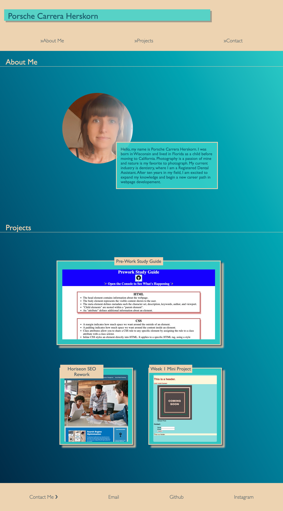

# Porsche Herskorn's Portfolio Webpage

## Description

This webpage was created to present a few of my projects from the UCB bootcamp program. Additionally a photo and a brief bio section serve to intoduce visitors to me.

While I have made use of some responsive design features and media queries, given more time and practice, I would like to implement additional features to make the site more mobile-friendly.

## Installation

N/A

## Usage

Opening the [Portfolio Webpage for Porsche Herskorn](https://eepitsporsche.github.io/porsche_herskorn_portfolio_webpage/) on a desktop presents some pseudo-class elements like hover effects for linked pages and highlighted text effects in the "About Me" section.
Adjusting the screen size to a width of >768px and >420px produces changes to the elements on the page to support better ease of viewing on smaller devices.

## Credits

For this project I referenced some of the starter code provided by [Quackit.com](https://www.quackit.com/html/html_editors/scratchpad/?example=/css/flexbox/tutorial/create_a_website_layout_with_flexbox_example_1) to help guide me with creating a general structure for my page.

## License

N/A